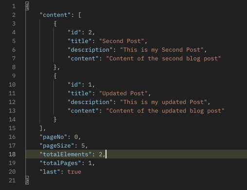
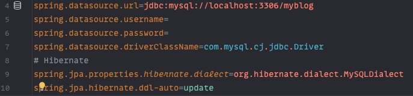

# Blog App REST API with Spring Boot

### Project Structure

# Roadmap 🚏

### ✅ Create Project and set up Structure

### ✅ Set up MySQL Database

* Created `myblog` database
* Configured `application.properties`
  

### ✅ Create JPA Entity - Post Entity

* Used **Lombok**

### ✅ Create JPA Repository - Post Repository

* ResourceNotFoundException Custom Exception created.

### ✅ Create DTO Class - PostDto

### CRUD Operations for Post

* Create Post implemented.
    * PostController Created.
        * Create Post method implemented.
    * PostService Created.
    * PostServiceImpl implemented.
